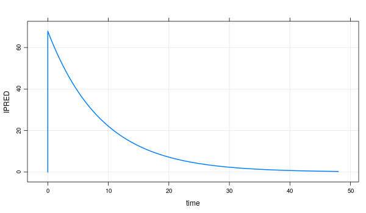

# hmctdm 

<!-- badges: start -->
[](#)

hmctdm is open source package for bayesian estimation of PK parameters using stan in R. The main function, `hmctdmrest()` , can estimate individual PK parameters. below is a drug that can be estimate from the function:

- Amikacin (IV)
- Vancomycin (IV)
- Theophiline (Oral)
- Phenytoin (Oral)

The pharmacokinetic model was implemented from the PKS program. 

## Installation

You can install development version from github by executing the following code in R console.

``` r
install.packages("devtools")
devtools::install_github("sikso1897/hmctdm")
```

hmctdm relies on the following software & packages. 
- [Stan](https://mc-stan.org/) is an open source probabilistic programing language designed primarily to do Bayesian data analysis
- [Torsten](https://metrumresearchgroup.github.io/Torsten/) is a collection of Stan functions to facilitate analysis of pharmacometric data. 
- [Mrgsolve](https://github.com/metrumresearchgroup/mrgsolve) is model implementation and ordinary differential equation solver


Please refer to the installation guide of these programs
- [install guide of stan](https://mc-stan.org/cmdstanr/)
- [install guide of torsten](https://metrumresearchgroup.github.io/Torsten/installation/)
- [install guide of mrgsolve](https://github.com/metrumresearchgroup/mrgsolve/wiki/mrgsolve-Installation)

## Example
``` r
library(cmdstanr)
library(hmctdm)
```
#### 1) set cmdstan path
``` r
HOME_TORSTEN <- "path/to/torsten"
suppressMessages(set_cmdstan_path(file.path(HOME_TORSTEN, 'cmdstan')))
```
#### 2) bring data set
checking the sample data and bring data of type `data.frame` or `tibble` by format of sample data.
```r
sample_data <- hmctdmr::get_sample_data(drug="amikacin")
sample_data

#   ID time evid amt cmt ss ii addl rate SEX AGE       WT       HT      SCR      DV
# 1  1    0    1 500   1  0  0    0 1000   1  79 43.97928 155.7253 1.072065  0.0000
# 2  1    1    0   0   1  0  0    0    0   1  79 43.97928 155.7253 1.072065 28.5206
```

#### 3) estimate
```r
hmctdm <- hmctdmr::hmctdmrest(drug="amikacin", data="your_data_set")
print(hmctdm)
```

``` r
# Model executable is up to date!
# Running MCMC with 4 sequential chains...

# Chain 1 finished in 0.6 seconds.
# Chain 2 finished in 0.6 seconds.
# Chain 3 finished in 0.5 seconds.
# Chain 4 finished in 0.5 seconds.

# All 4 chains finished successfully.
# Mean chain execution time: 0.6 seconds.
# Total execution time: 3.0 seconds.
# Building amikacin ... done.
# Building amikacin ... (waiting) ...
# done.

# Status:  Sample 
# Drug:  Amikacin 


# Stan sample option: 
# # A tibble: 1 × 3
#   option            dir       compile
#   <chr>             <chr>     <chr>  
# 1 stan_model_option .../stanc TRUE   

# Stan model option: 
# # A tibble: 1 × 7
#   option             chains thin  iter_warmup iter_sampling output_dir      adapt_delta
#   <chr>              <chr>  <chr> <chr>       <chr>         <chr>           <chr>      
# 1 stan_sample_option 4      1     2500        2500          .../stan_output 0.95       

# Prior Information: 
# # A tibble: 6 × 2
#   parameter             value
#   <chr>                 <dbl>
# 1 Prior_CL_NR          0.0417
# 2 Prior_VD_NR          0.27  
# 3 Prior_CL_SLOPE       0.815 
# 4 Prior_CL_NR_omega    0.246 
# 5 Prior_VD_NR_omega    0.294 
# 6 Prior_CL_SLOPE_omega 0.385 

# Estimated PK Parameters: 
# # A tibble: 5 × 10
#   variable    mean  median     sd    mad      q5     q95  rhat ess_bulk ess_tail
#   <chr>      <dbl>   <dbl>  <dbl>  <dbl>   <dbl>   <dbl> <dbl>    <dbl>    <dbl>
# 1 CL_NR     0.0431  0.0419 0.0108 0.0104  0.0277  0.0626  1.00    6045.    4133.
# 2 VD_NR     0.336   0.335  0.0556 0.0554  0.247   0.429   1.00    6087.    5655.
# 3 CL_SLOPE  0.925   0.853  0.382  0.330   0.450   1.64    1.00    4353.    3045.
# 4 CL        2.00    1.85   0.778  0.673   1.03    3.45    1.00    4338.    3091.
# 5 VD       14.8    14.7    2.44   2.44   10.9    18.9     1.00    6087.    5655.

# Estimated Concentration: 
#   ID time evid amt cmt ss ii addl rate SEX AGE       WT      LBW       HT      SCR     CrCL      DV     cHat
# 1  1    0    1 500   1  0  0    0 1000   1  79 43.97928 43.97928 155.7253 1.072065 33.95356  0.0000  0.00000
# 2  1    1    0   0   1  0  0    0    0   1  79 43.97928 43.97928 155.7253 1.072065 33.95356 28.5206 30.65465

# Individual Data: 
#   ID SEX AGE       WT      LBW       HT      SCR     CrCL     CL_NR    VD_NR CL_SLOPE      CL       VD
# 1  1   1  79 43.97928 43.97928 155.7253 1.072065 33.95356 0.0418793 0.334881 0.853423 1.85247 14.72785

```
#### 4) predict concentration
The concentration at the new time point is predicted using the mrgsolve model, which is the same as the pharmacokinetic model used for estimation. The result contains an mrgsolve model object.

```r 

hmctdm <- hmctdmr::hmctdmrest(drug="amikacin", data="your_data_set")

hmctdm$mrgmod                                                                                                                                                         
# ---------------  source: amikacin.cpp  ---------------

#   project: ...inst/mrgsolve
#   shared object: amikacin-so-22cda12102f 

#   time:          start: 0 end: 30 delta: 0.5
#                  add: <none>

#   compartments:  CENT [1]
#   parameters:    WT LBW CLCR CL_NR CL_SLOPE VD_NR
#                  VD_SLOPE UNIT_CL [8]
#   captures:      CL VD IPRED [3]
#   omega:         0x0 
#   sigma:         0x0 

#   solver:        atol: 1e-08 rtol: 1e-05 maxsteps: 20k
# ------------------------------------------------------

mrgmod <- hmctdm$mrgmod %>%  
  mrgsolve::ev(amt=1000) %>% 
  mrgsolve::mrgsim(end=48, delta=0.5)  

mrgmod
# Model:  amikacin 
# Dim:    98 x 19 
# Time:   0 to 48 
# ID:     1 
#     ID time evid  amt cmt ss ii addl rate SEX AGE    WT    HT   LBW   SCR    AUC    CL    VD IPRED
# 1:   1  0.0    0    0   0  0  0    0    0   1  79 43.98 155.7 43.98 1.072   0.00 1.651 14.75  0.00
# 2:   1  0.0    1 1000   1  0  0    0    0   1  79 43.98 155.7 43.98 1.072   0.00 1.651 14.75 67.79
# 3:   1  0.5    0    0   0  0  0    0    0   1  79 43.98 155.7 43.98 1.072  32.97 1.651 14.75 64.10
# 4:   1  1.0    0    0   0  0  0    0    0   1  79 43.98 155.7 43.98 1.072  64.14 1.651 14.75 60.61
# 5:   1  1.5    0    0   0  0  0    0    0   1  79 43.98 155.7 43.98 1.072  93.61 1.651 14.75 57.32
# 6:   1  2.0    0    0   0  0  0    0    0   1  79 43.98 155.7 43.98 1.072 121.48 1.651 14.75 54.20
# 7:   1  2.5    0    0   0  0  0    0    0   1  79 43.98 155.7 43.98 1.072 147.84 1.651 14.75 51.25
# 8:   1  3.0    0    0   0  0  0    0    0   1  79 43.98 155.7 43.98 1.072 172.76 1.651 14.75 48.46
```
This object can use generic functions. More details can be found [here](https://mrgsolve.github.io/). below is generic functions example.  
``` r
mrgmod %>%
  mrgsolve::plot(IPRED ~ time)
```
[](#)

#### 5) usage for get recommended dose
using the mrgsolve model in which the parameters estimated above are used, various dosage regimens can be simulated and drug titration regimens can be obtained. (`get_recommended_dose`, `get_b_cp`)

each parameter used in the function is calculated based on the steady state. In order to know the steady state of the current regimens, you can obtain the result in the steady state by using the following code.

```r
simdata <- hmctdm$mrgmod %>%
            mrgsolve::ev(amt=200, ii=12, addl=4, ss=1) %>%  # current regimen with ss=1 added. 
            mrgsolve::mrgsim(end=48, delta=0.5)
```
you can see the result with the code below and the result contains the concentration and AUC for each hour here.

```r
# data.table
print(simdata@data) # or simdata

# plot
simdata %>%
  mrgsolve::plot(IPRED ~ time)
```

creating event(regimens) is described in the mrgsolve specific section below, and more detailed information can be found in [mregsolve repository](https://mrgsolve.github.io/).

5-1) `get_b_cp`

`get_b_cp` is a function that calculates the average steady-state concentration($\bar{C_p}$) by inducing the estimated pharmacokinetic parameters with the following equation.

$$
\overline{C_p} = \frac{-b + \sqrt{b^2 - 4\cdot a \cdot c}}{2 \cdot a}
$$
- $r = \frac{D\cdot S\cdot F}{\tau}$
- $\tau =$ dosing interval
- $D =$ dose
- $S =$ salt factor
- $F =$ bioavailability
- $a = \frac{CL_{plasma}}{V_d}$
- $b = \frac{(r-V_{max})-(CL_{plasma} - K_m)}{V_d}$
- $c = \frac{Km \cdot r}{V_d}$ 

PK parameters as a result of the estimation can be obtained as follows. 

```r
hmctdm$param
```

the parameters as the `get_b_cp` parameter to get the result. 

```r
get_b_Cp(dose=dose, F=F, tau=tau, CLp=CLp, 
          Vd=Vd, Vmax=Vmax, Km=Km) # default salt_factor=1
```


5-2) `get_recommended_dose`

`get_recommended_dose` calculates the appropriate dose by using the following formula to obtain the target result.

paramerters are `mode`, `target`, `current_dose`, `current_status`, `non-linear pk parameters` 

- `mode` is what you want to target. 
  - `AUC` is steady-state $AUC_t$ 
  - `Cp` is steady-state concetration $C_p$
  - `b_Cp` is average steady-state concentration $\overline{C_p}$
  
- `target` is the desired value
- `current_dose` is dosage of current regimen
- `current_status` is if the current regimen is maintained, the value at target time
  ```r
  simdata <- hmctdm$mrgmod %>%
            mrgsolve::ev(amt=200, ii=12, addl=4, ss=1) %>%  # current regimen with ss=1 added. 
            mrgsolve::mrgsim(end=48, delta=0.5)

  ```

- `non-linear pk params`
  - if `mode` is average steady-state concentration(=`b_Cp`), the following parameters are required. (`Vmax`, `CL_R`, `Km`, `F`, `tau`) 
 
5-2-a) Stedy-state concentration
$$
\text{Recommended Dose} = \frac{\text{Current Dose}}{C^{SS}_{t,\text{current dose}}} \times {C^{SS}_{t,\text{target}}}
$$

5-2-b) Steady-state AUC
$$
\text{Recommended Dose} = \frac{\text{Current Dose}}{AUC^{SS}_{t,\text{current dose}}} \times {AUC^{SS}_{t,\text{target}}}
$$

5-2-c) Average steady-state concentration
$$
\text{Recommended Dose} = \frac{V_{max}/24 + CL_r \times (K_m - {\overline C}_\text{target})}{(K_m + {\overline C}_\text{target}) \times F} \times {\overline C}_\text{target} \times \tau
$$

```r
get_recommended_dose(mode=mode, target=target, 
                      current_dose=current_dose,
                      current_status=current_status,
                      ...)
# ... is non-linear pk params. if mode use b_Cp, have to insert non-linear pk params like Vmax mentioned at above phrase
```

## Specific

### 1) mrgsolve specific
this session is introduction to `mrgsolve` model object, focusing on the simulation used in `hcmtdmr`. if you want to know more details, for more information at [mregsolve repository](https://mrgsolve.github.io/).

```R
# how to get mrgsolve model object at result
est <- hmctdmr::hmctdmrest(...)
mrgmod <- est$mrgmod

# or if you want to get default mrgsolve model in package
mrgmod <- hmctdmr::get_mrgmod(drug="drug") # drug, amikacin, vanocomycin ...
```

the overall process of using mrgsolve in a package is as follows step. step-1) define a pharmacokinetic model, step-2) enter patient information in the model, step-3) generate a dosing event. step-4) Run the simulation. the package returns an object that has progressed up to step-2.

information about model details can be obtained by printing the object.
```r
print(mrgmod)
# ---------------  source: amikacin.cpp  ---------------

#   project: ...inst/mrgsolve
#   shared object: amikacin-so-22cda12102f 

#   time:          start: 0 end: 30 delta: 0.5
#                  add: <none>

#   compartments:  CENT [1]
#   parameters:    WT LBW CLCR CL_NR CL_SLOPE VD_NR
#                  VD_SLOPE UNIT_CL [8]
#   captures:      CL VD IPRED [3]
#   omega:         0x0 
#   sigma:         0x0 

#   solver:        atol: 1e-08 rtol: 1e-05 maxsteps: 20k
# ------------------------------------------------------
```
step-3 and 4 provide simulations that allow users to experiment with different drug regimens. (to improve regimen) it proceeds in the form of example-4 (prediction). 

```r
mrgmod <- hmctdm$mrgmod %>%  
  mrgsolve::ev(amt=1000) %>% 
  mrgsolve::mrgsim(end=48, delta=0.5)  
```
- `ev`
- `mrgsim`

1-1) event
```R
event <- mrgsolve::ev()

# or multiple event
event <- mrgsolve::expand.ev()

```

1-2) mrgsim

```R
```

### 2) hmctdm specific 
`hmctdmrest` takes the following parameters:

```r
hmctdmrest <- function(drug=NULL, 
                    data=NULL,
                    prior=NULL, 
                    stan_model_option=NULL,
                    stan_sample_option=NULL){
                    ...
}
```
hmctdmrest can be given the following parameters:
#### `drug`
  - amikacin
  - vancomycin
  - theophiline
  - phenytoine
  
#### `data`
checking the sample data as using `get_sample_data` and bring data of type `data.frame` or `tibble` by format of sample data. 

```r
sample_data <- hmctdmr::get_sample_data(drug="amikacin")
sample_data

#   ID time evid amt cmt ss ii addl rate SEX AGE       WT       HT      SCR      DV
# 1  1    0    1 500   1  0  0    0 1000   1  79 43.97928 155.7253 1.072065  0.0000
# 2  1    1    0   0   1  0  0    0    0   1  79 43.97928 155.7253 1.072065 28.5206
```
- `ID` is subject indicator.
- `time`, `evid`, `amt`, `cmt`, `ss`, `ii`, `addl`, `rate` are described in the mrgsolve specific section..
- `SEX`, `AGE`, `WT`, `HT` are demographics. (sex, age, weight, height)
- `SCR`, `DV` is serum creatinine and concentration.


#### `prior`
It can be changed by passing the prior parameter in the list.
```r
# example

hmctdmr::get_default_prior(drug="amikacin")
# $Prior_CL_NR
# [1] 0.0417

# $Prior_VD_NR
# [1] 0.27

# $Prior_CL_SLOPE
# [1] 0.815

# $Prior_CL_NR_omega
# [1] 0.2462207

# $Prior_VD_NR_omega
# [1] 0.2935604

# $Prior_CL_SLOPE_omega
# [1] 0.3852532


hmctdm <- hmctdmr::hmctdmrest(
                    drug="amikacin", 
                    data="your_data_set",
                    prior=list(
                      CL_NR=0.5,
                      CL_NR_omega=0.3
                    ))
}
```
#### `stan_model_option` 

stan_model_option is an option for creating a new CmdStanModel object from a file containing a Stan program. More information on the options can be found [here](https://mc-stan.org/cmdstanr/reference/cmdstan_model.html) 

#### `stan_sample_option`
stan_sample_option is option of `$sample()` method CmdStanModel objcet runs the default MCMC algorithm in CmdStan (algorithm = hmc, engine=nuts). More information on the options can be found [here](https://mc-stan.org/cmdstanr/reference/model-method-sample.html)

 
## Development
hmctdm is under development. Your feedback for additional feature requests or bug reporting is welcome. Contact us through the issue tracker.

